# Mermaid — Markdown 图表

在 Markdown 中用 ` ```mermaid ` 代码块编写图表。

---

## Flowchart — 流程图

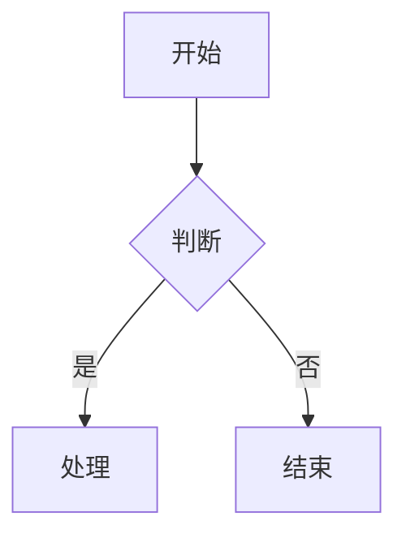

### 方向

| 语法 | 方向 |
|------|------|
| `TD` / `TB` | 从上到下 |
| `BT` | 从下到上 |
| `LR` | 从左到右 |
| `RL` | 从右到左 |

### 节点形状

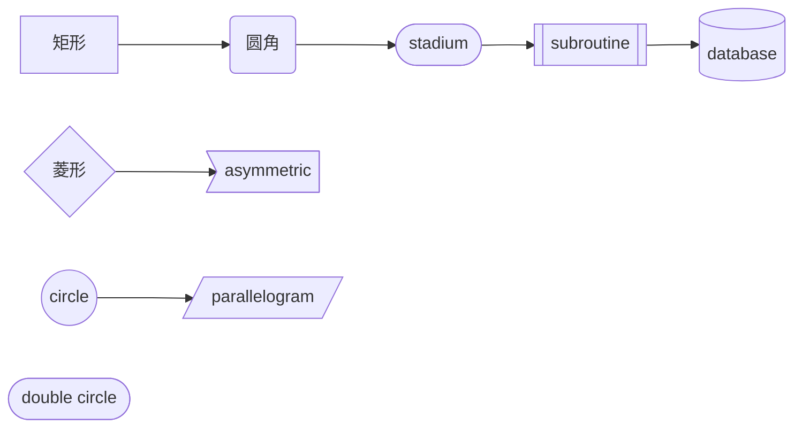

| 语法 | 形状 |
|------|------|
| `A[text]` | 矩形 |
| `A(text)` | 圆角 |
| `A([text])` | stadium |
| `A[[text]]` | subroutine |
| `A[(text)]` | 圆柱（数据库） |
| `A{text}` | 菱形（判断） |
| `A((text))` | 圆形 |
| `A>text]` | 不对称 |
| `A[/text/]` | 平行四边形 |

### 连线

| 语法 | 类型 |
|------|------|
| `A-->B` | 箭头 |
| `A---B` | 无箭头 |
| `A-.->B` | 虚线箭头 |
| `A==>B` | 粗线箭头 |
| `A--text-->B` | 带文字箭头 |
| `A -->|text| B` | 带文字箭头（另一种） |
| `A~~~B` | 不可见线（调整布局） |

### Subgraph

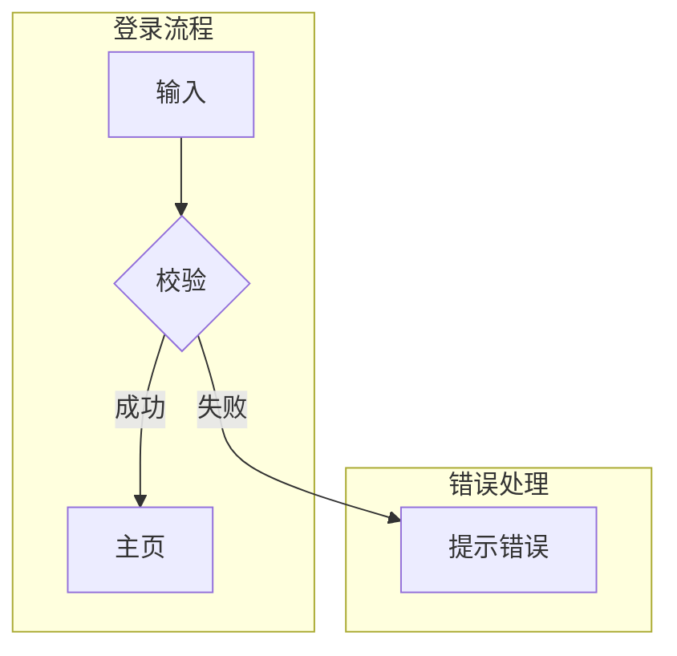

### 样式

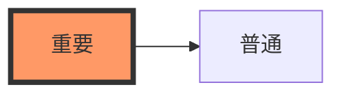

---

## Sequence Diagram — 时序图

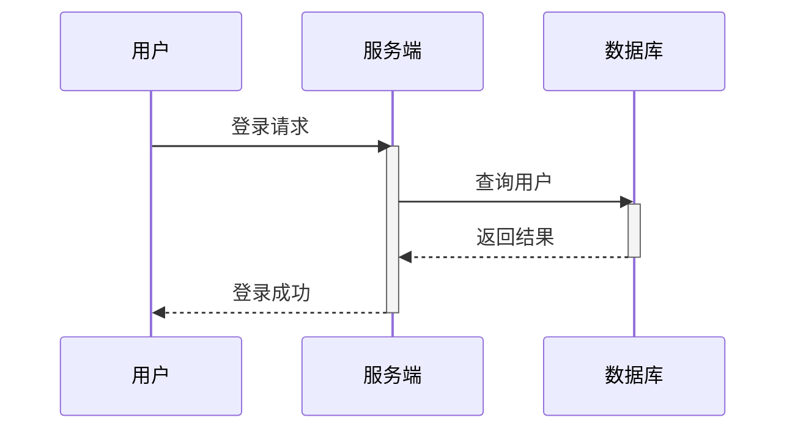

### 消息类型

| 语法 | 类型 |
|------|------|
| `->` | 实线无箭头 |
| `->>` | 实线箭头 |
| `-->>` | 虚线箭头 |
| `-x` | 实线 X 结尾 |
| `--)` | 实线开放箭头（异步） |
| `<<->>` | 双向箭头 |

### 生命周期

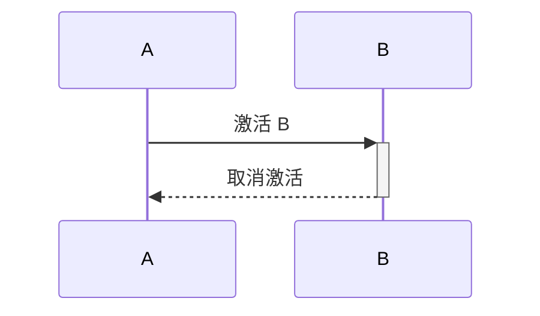

`+` = activate, `-` = deactivate（缩写形式）

### 组合片段

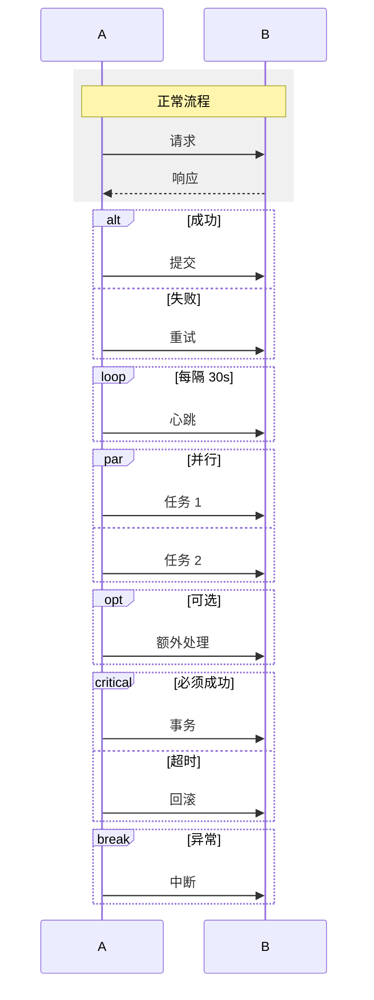

### Notes / Actors / Box

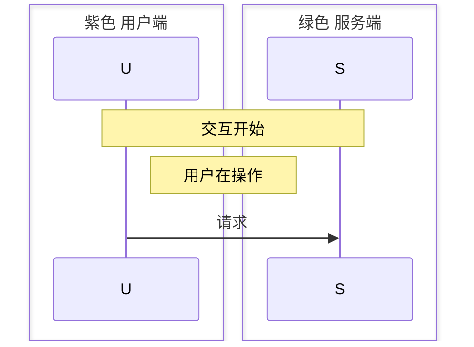

---

## Class Diagram — 类图

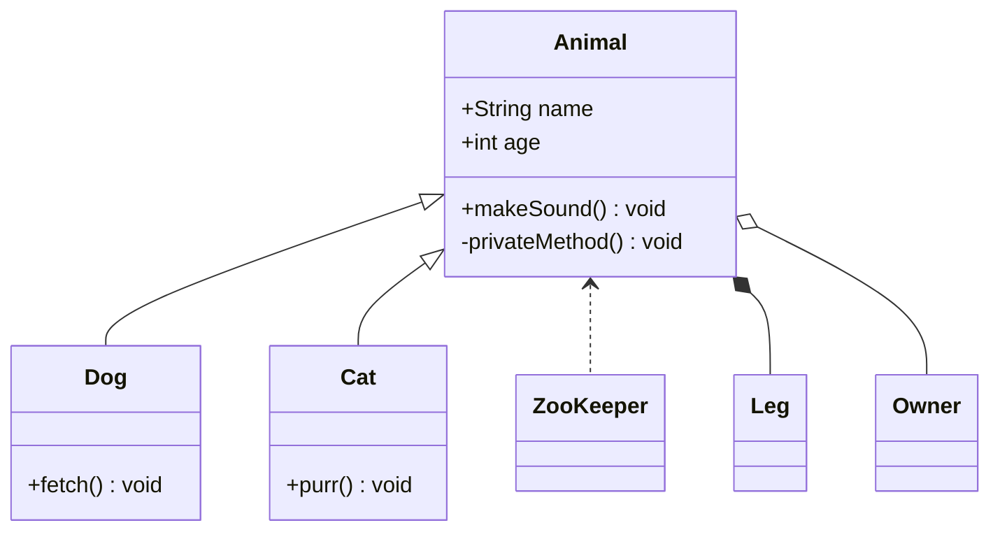

### 关系

| 符号 | 关系 |
|------|------|
| `<\|--` | 继承 |
| `*--` | 组合 |
| `o--` | 聚合 |
| `-->` | 关联 |
| `..>` | 依赖 |
| `..\|>` | 实现 |

### 修饰符

| 符号 | 可见性 |
|------|--------|
| `+` | public |
| `-` | private |
| `#` | protected |
| `~` | package |

---

## State Diagram — 状态图

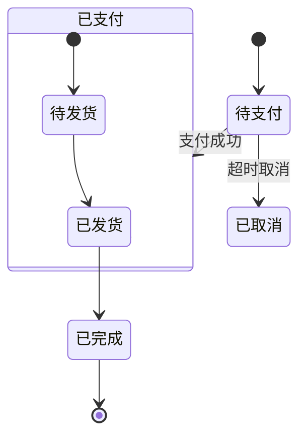

---

## Entity Relationship Diagram — ER 图

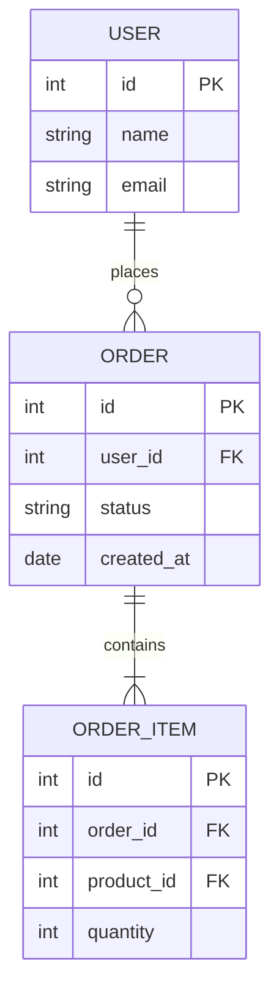

---

## Gitgraph — Git 分支图

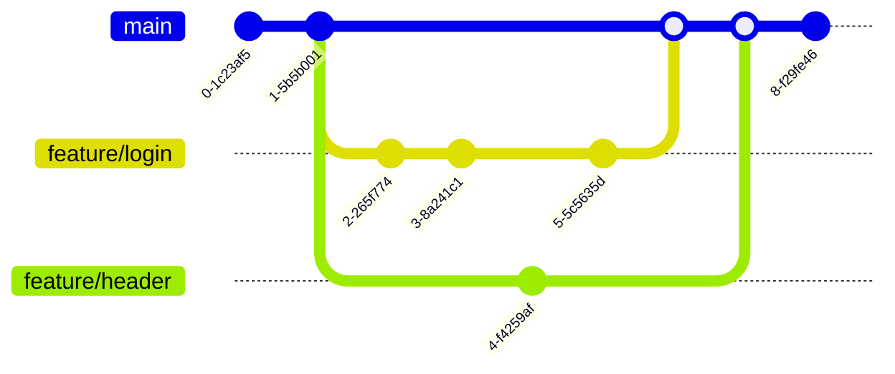

---

## Mindmap — 思维导图

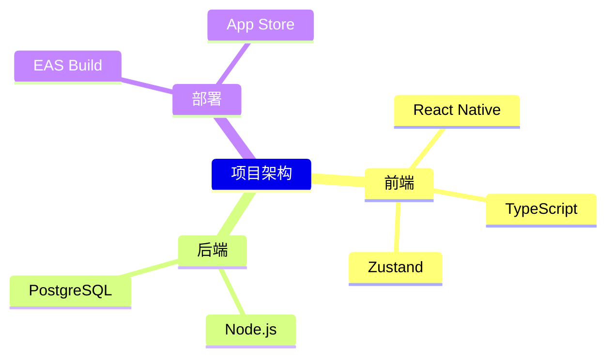

---

## Timeline — 时间线

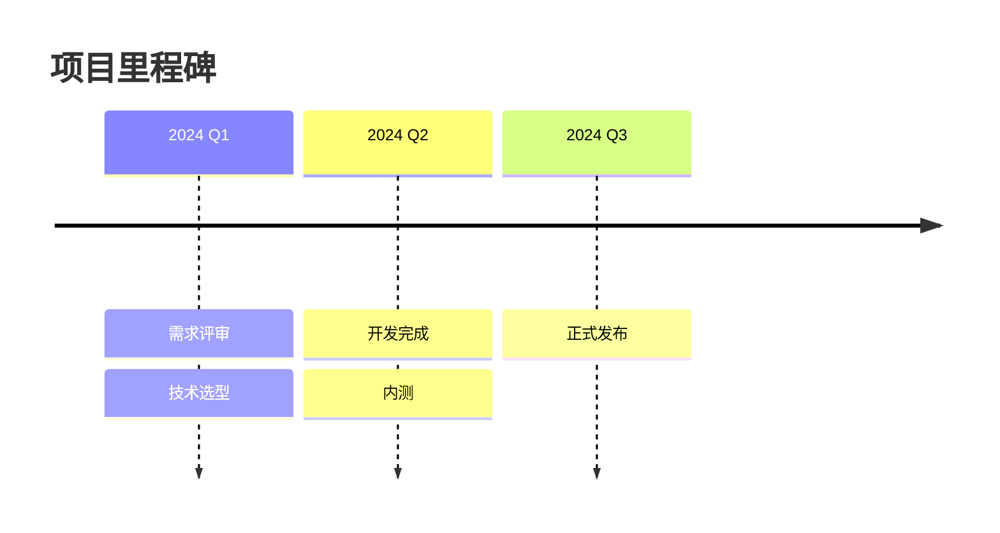

---

## 常用配置

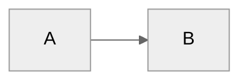

---

## Red Flags

- ❌ `flowchart` 中节点 ID 不能是纯小写 `end` → 用 `END` 或 `"end"`
- ❌ `flowchart` 中以 `o` / `x` 开头的连线会被解析为 circle / cross edge → 加空格 `dev--- ops`
- ❌ `sequenceDiagram` 中 `end` 作为参与者名会中断 → 用 `(end)`、`[end]` 或引号包裹
- ❌ 外部 CSS 覆盖 Mermaid 样式无效 → 用 `classDef` 语法内部定义
- ❌ 中文换行用 `<br>` 而不是直接换行
